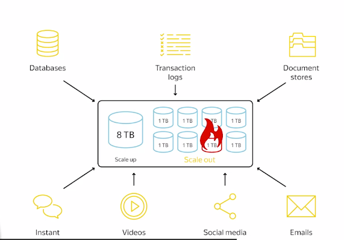

# HDFS

Created By: Geunho Lee
Last Edited: Mar 14, 2020 1:03 PM
Tags: HDFS

- Scale-up
- Scale-out

- 구글 파일 시스템의 오픈소스화 → HDFS (사용한 언어와 이름만 좀 바뀜)

1. HDFS client API를 통해서 요청하면
2. Namenode에서 location 가져오고
3. Stream API 통해서 타겟 datanode 값들 읽는 방식

### HDFS Client

    hdfs dfs -help
    hdfs dfs -usage <utility_name>

    hdfs dfs -ls -R -h /data/wiki
    hdfs dfs -mkdir /foo/bar
    hdfs dfs -rm deep
    hdfs dfs -touchz file.txt

    hdfs dfs -put <src> <dst>
    hdfs dfs -get <HDFS location> <Local location>

### Namenode Architecture

### File Types

**Test formats**

- csv, tsv, json, xml
- Human readable
- Textual form → Programmable form (Parsing price)
- CSV, TSV → Bad space efficiency, Good speed, Only String
- JSON, XML → Bad space efficiency than CSV, Support various data types

**Binary formats**

- SequenceFile → (Key, Value) 형태

- Columnar File (RCFile, Parquet)

- 많이 쓰는 포맷, 그러나 디테일까지는 지금 알 필요 없음

Conclusion

- 대체로 Binary format 사용하는 것이 빅데이터에선 좋음