cs224n-2019-lecture07-fancy-rnn
=============
Problem of vanilla rnn
------------
1. vanishing gradient
2. exploding gradient

Vanishing Gradient
------------
* 거리가 멀어질수록, gradient signal이 약해진다

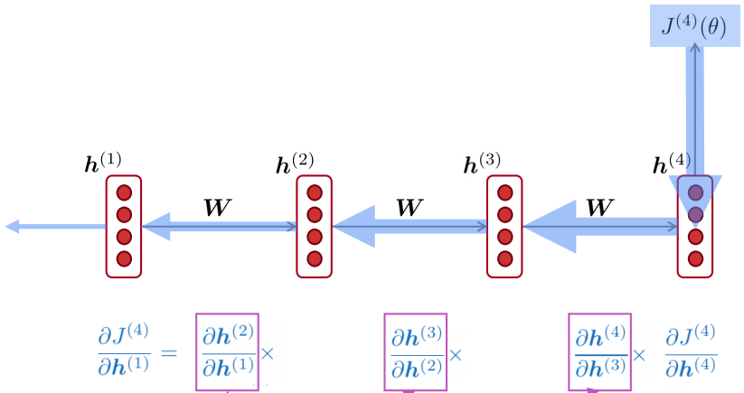</img>

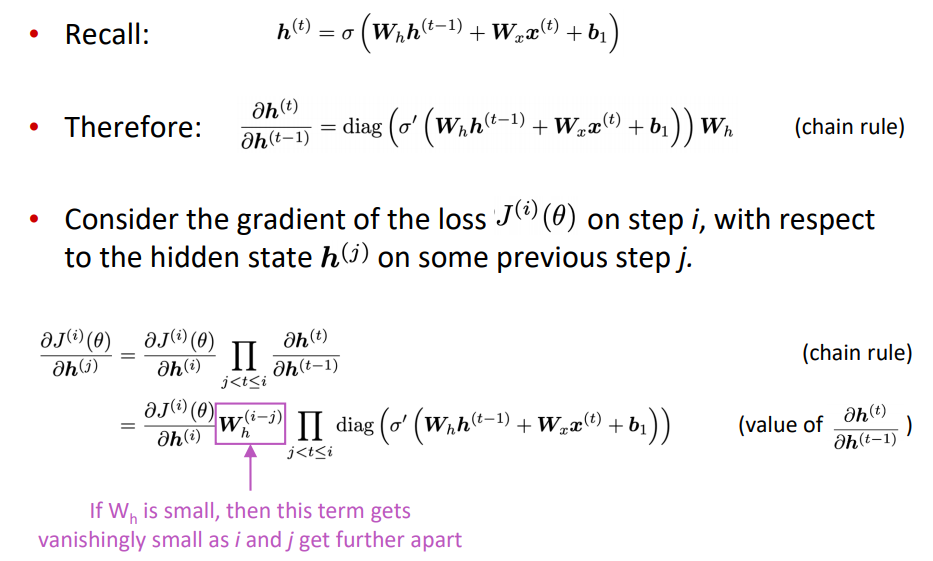</img>

* 문제가 되는 이유

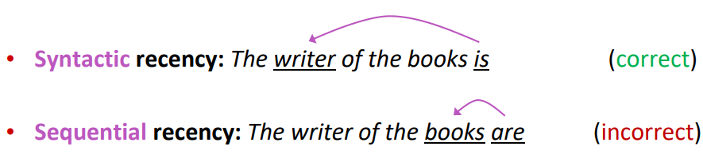</img>
* 해결방안
    * LSTM, GRU

Exploding Gradient
------------
* 반대로 gradient가 너무 커져도 문제가 생김 (sgd update step이 너무 큼)
* 문제가 되는 이유
    * network 값이 inf나 nan이 될수도

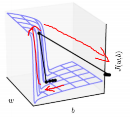</img>
* 해결방안
    * LSTM, GRU
    * gradient cliffing: gradient가 threshold보다 크면 줄여줌
    
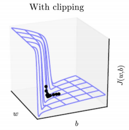</img>

LSTM, GRU
------------
* vanishing, exploding gradient의 원인은 hidden state를 계속 사용하기 때문
    * -> seperate memory를 만들어서 해결하자
    
**1. LSTM**
* 같은 크기의 hidden state와, cell state를 가짐
* cell state의 정보를 얼마나 erase, read, write 할지 결정
    * forget, input, output gate: 각 element가 0~1 사이 값
    
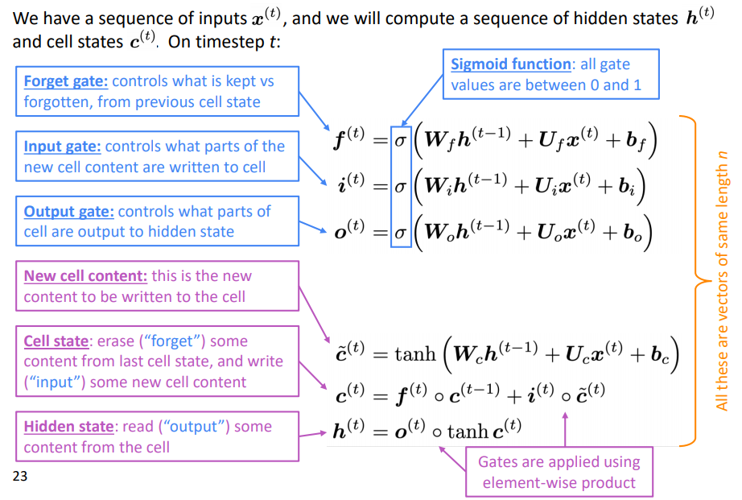</img>

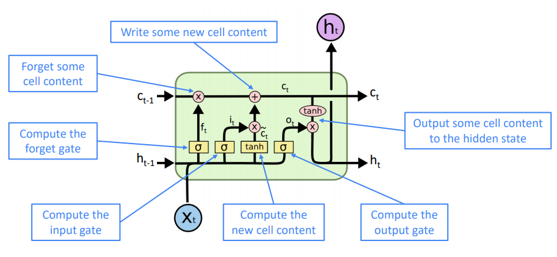</img>

**2. GRU**
* lstm의 간소화버전. cell state 없이 해결함
* update gate: lstm의 forget, input gate역할
* reset gate: select what part of prev hidden state to use

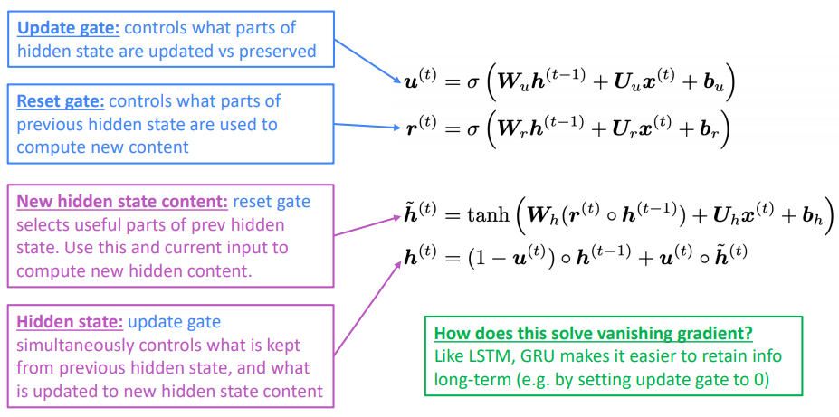</img>

**3. LSTM vs GRU**
* GRU가 더 빠름
* 성능적으로 명확히 비교된 적은 없음
* LSTM으로 시작 후, 최적화를 원한다면 GRU를 고려하는 것 추천

vanishing/exploding의 일반적인 해결방안
------------
* vanishing, exploding gradient는 rnn만의 문제가 아니라 ffnn이나 conv에서도 발생하는 문제임
* 해결방안
    * residual network(skip connection)
    * dense connection
    * highway
        * ff나 conv에, lstm에서와 같은 dynamic gate 적용
        
        
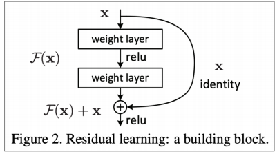</img>

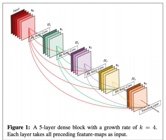</img>

fancy RNN variants
------------
* bidirectional rnn
    * powerful if you have entire input sequence. e.g.) encoding
    
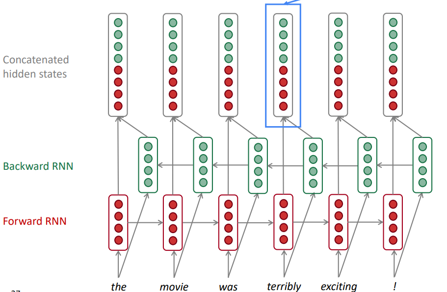</img>

* multi-layer rnn

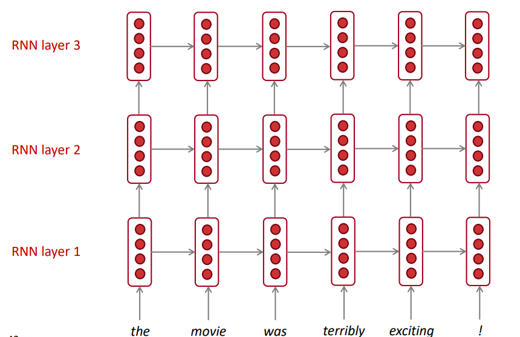</img>
