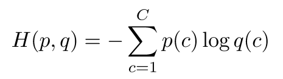
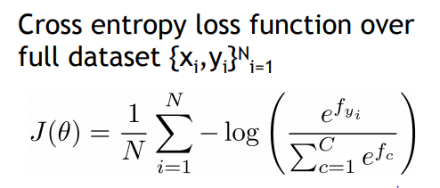
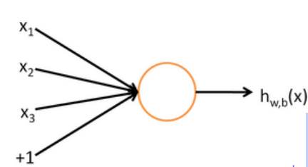
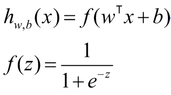
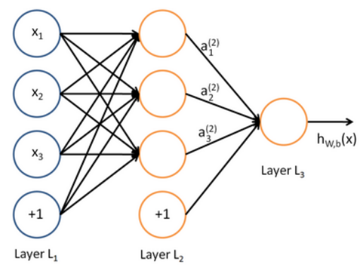
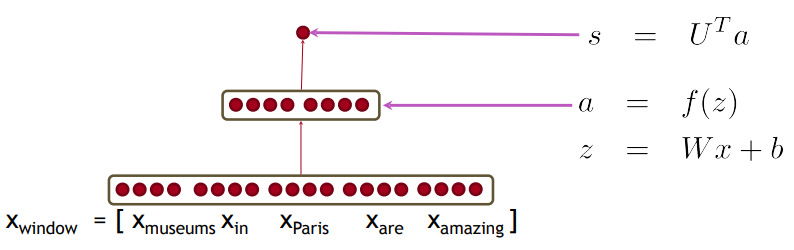
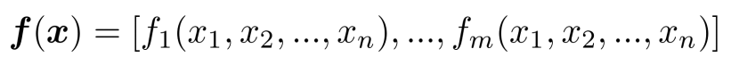
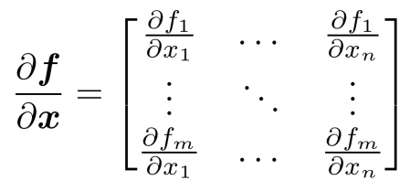
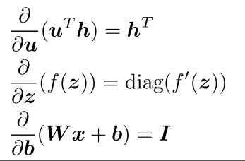
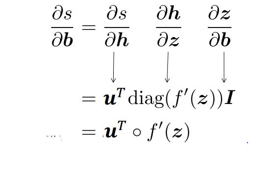

cs224n-2020-lecture03-Neural Networks
=============
Cross Entropy
-------------
의미: 실제 probability distribution과 예측모델의 probability distribution의 차이를 측정

</img>

* p = true probability, q = predicted probability

* p는 [0,0,0,1,0,0 ... ] 형태의 one-hot 이니까 

    - -> negative log prob of ture class 만 남음

* 전체 dataset에 대하여 cross entropy loss의 평균을 구한다면?

</img>

Neural Network Classifier
-------------
* 다른 Classifier와의 
    * 오랫동안 사용된 conventional models(naive bayes, SVM, softmax)
        - update decision boundaries
        - draw line
    
    * neural network
        - non-linear
        - complex problem (language, speech, image)
        - learn representation (임베딩 학습 가능)

* Neuron
    - 하나의 neuron은 binary logistic regression과 같음
        
    - </img>

    - </img>
    
* Neural Network
    - 여러번의 logistic regression을 이어서 수행함
    - </img>

Named Entity Recognition (NER)
-------------
=> 문서에서 내가 지정한 개체명(named entity)을 검출해낸다 

* NER이 어려운 이유
    - 어디부터 어디까지 개체명으로 봐야 하는지 boundary가 애매함
    - 처음보는 단어, 고유명사 등에 대처하기 힘듦
    - 같은 단어여도, 문맥(context)에 따라 정답이 달라짐
    
* Word-Window classification
    - window를 씌우고, 같은 window내의 neighbor words들을 고려하여 개체명을 추론하자 (context 반영 가능)
    - 방법 1: average word vectors in window
        * 단어간의 순서 정보를 잃음
    - 방법 2: concat word vectors in window
        * 순서정보 표현 가능
        * 방법 2를 활용해서 neural net을 정의해보자
        * </img>
        
Calculating Gradients
-------------
n개의 input과 m개의 output을 가지고 있는 함수가 있을 때 (n개의 변수를 가진 함수가 m개가 있을 때)

</img>
    
jacobian matrix를 활용하여 편미분을 쉽게 할 수 있다.

</img>
    
* useful jacobian tips

</img>

* jacobian과 chain rule을 사용하여 s를 b에대하여 미분해보자

our NER classifier was ... 

</img>

by using 'useful jacobian tips' and 'chain rule' ...

</img>
    
    
    
