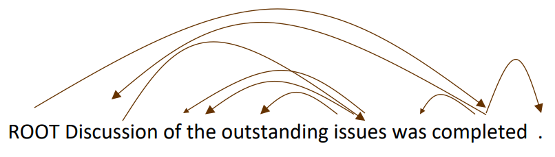
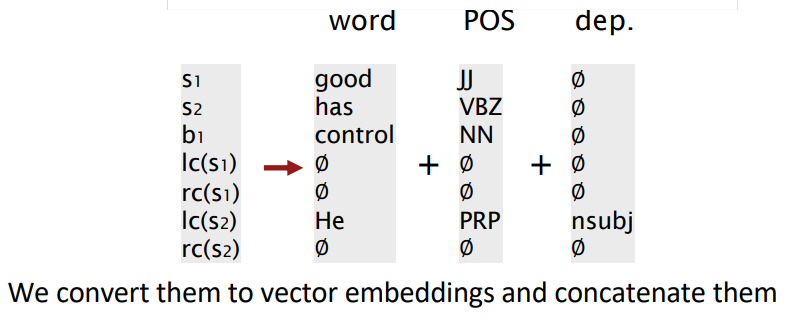

cs224n-lecture05-Dependency Parsing
=============
Two views of linguistic structure
-------------

1. Phrase Structure (context free grammar)
: 문장을 구성하는 규칙, 유형에 따라 분석

</img>

2. Dependency Structure
: 연관된 단어들을 연결하여 분석

* dependency structure의 두가지 표현 방법

</img>

</img>

-> why do we need sentence structure?

* 복잡한 문장을 이해하기 위해서, 각 단어간의 관계를 잘 파악해야 함

* 중의적인 문장들에서 오해하지 않기 위해

How to build dependency parser
------------
</img>

* dependency parser 만들 때 사용 할 수 있는 정보들

    * Bilexical affinities : 유사한 단어들끼리 연결될 확률 높음↑
    * Dependency distance : 단어간 거리가 가까울수록 연결될 확률 높음↑
    * Intervening material : 동사나 마침표 넘어서 연결될 확률 낮음↓
    * Valency of heads : 특정 단어에 대하여, 보통 어느방향으로 연결되는가
    * 제약조건1: ROOT와는 한 단어만 연결된다
    * 제약조건2: Cycle을 형성하지 않는다

* Greedy transition-based parsing (shift-reduce parcer)

   
</img>
 * stack, buffer 를 정의. iteration마다 1,2,3 중 하나를 수행한다
 
 * example
 
</img>

</img>

* MaltParser
    
    * 위 greedy approach에서. 1,2,3중 어떤 동작을 수행할지 판단해주는 classifier
    * greedy -> search 알고리즘이 없어, 수행속도 매우 빠름.
    * not SOTA but, fast linear time parsing with great performance
    * top of stack word, stack second word, top of buffer word, postag 등의 vector를 concat하여 사용
    * 단점: 매우 크고 sparse한 vector를 사용하게 됨 (dim = 10^6 ~ 10^7)

* Neural dependency parser
    
    * one-hot vector 대신, pretrained word2vec을 사용
    * MaltParser보다 vector size가 매우 줄어들어, 속도도 빠르고 성능도 향상됨
    
    </img>

    </img>
