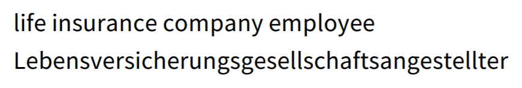

# cs224n-2019-lecture12-subwordmodel

## tiny bit of linguistics

### meaning
- sounds don't have any meaning
- 형태소는 최소단위의 의미를 가지고 있음

### 띄어쓰기
- 띄어쓰기를 안하는 언어 (중국어)
- 접두사 접미사를 띄는/붙이는 언어
- 혼합 명사를 띄는/붙이는 언어

</img>

### 문자 소리 특징
- digraphs(문자2개가 한 소리 만듦)
- syllable(한 글자가 한 소리 만듦)
- ideographic(표의문자)

</img>

## model below word level
- large, open vocab 필요성 발생: social mdedia

</img>

### purely character level model
- LSTM based NMT system
    * 잘 됐지만 sequece가 길어져서 too slow
    * word level model의 UNK 문제를 개선
    * </img>
    
- CNN based
- LSTM char level, bpe level

## sub word model: two trends
- same architecture as word level model, but smaller units
- hybrid architecture

### byte pair encoding
- 압축 알고리즘: 자주 반복되는 byte pair를 새로운 byte로 치환
- 절차:
    * start with all characters in vocab
    * add a most freq pair (반복: untill VOCAB_SIZE)
    * do deterministic longest piece segmentation of words
    
</img>

</img>

### word piece / sentence piece model
- 빈도수 기반이 아니라 LM likelihood 기준으로 생성
    * Add n-gram that maximally reduces perplexity
- white space를 '_'로 치환
- word piece model은 앞단에 tokenization이 있다고 가정
- word piece model은 구글 내부에서만 사용

## hybrid character-word
- character embedding -> word embedding -> task 수행
- 성능도 좋고 oov도 해결함

</img>

</img>

</img>

</img>

## fasttext
- skip-gram을 n-gram 단위로 함
- morphology가 중요한 언어에서 강력함
- ex) 'where'를 6개의 단어로 나누어 학습: <wh, whe, her, ere, re>, <where>
- 이 n-gram vector들의 합을 word vector로 사용
