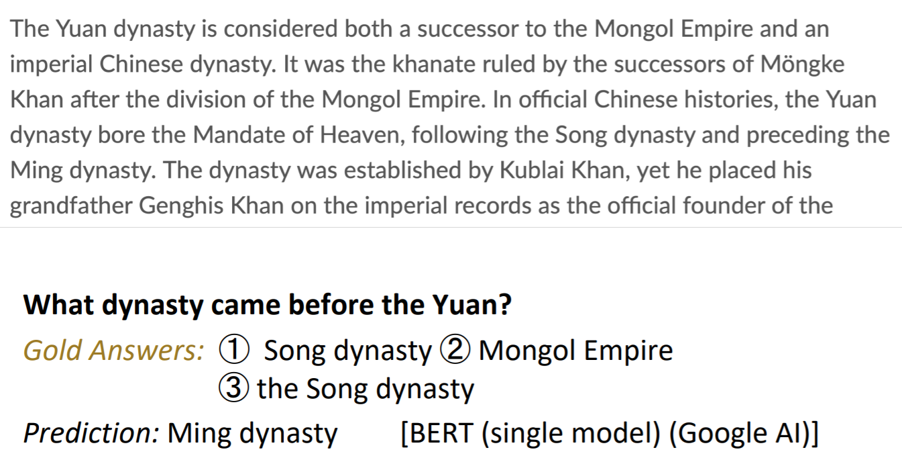
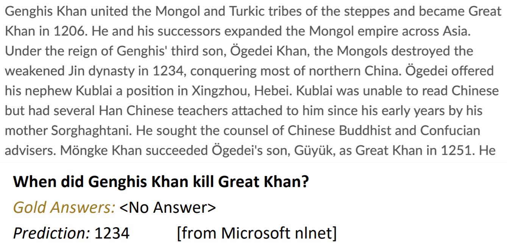
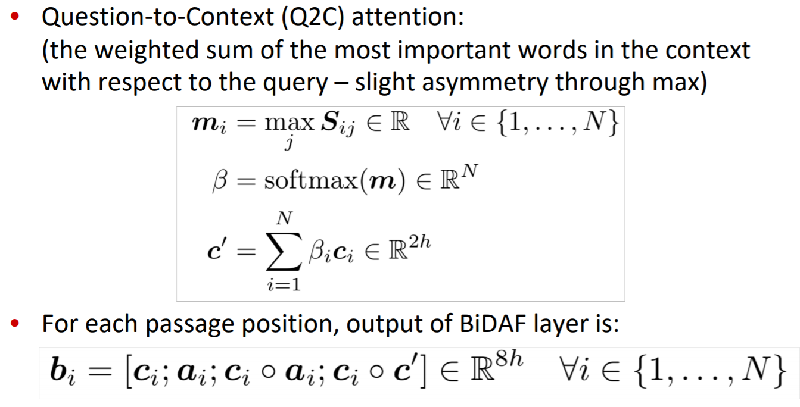

cs224n-2019-lecture10-QA
=============
Type of Question Answering
------------
1. 문서 검색: finding documents that might contain an answer
- 문서군 안에서 적정 문서 찾기
2. 독해(reading comprehension) : finding answer in a paragraph or document  
- 문서 안에서 적정 words 찾기 -> 이번에 다룰 내용

</img>

Machine Comprehension
------------
- comprehends a passage of text
- for any question, that can be answered by majority of nature speakers
- not contain irrelevant info
- passage + question -> answer

SQUAD: stanford question answering data set
------------
SQUAD 1.1
- Answer **must be in** passage
- 답이 애매할 수 있다?
    - 3명의 사람이 말한 답들을 모두 활용하여 평가
- metric
    - exact match : 3개의 답 중 일치하는 것이 있으면 1, 없으면 0 -> accuracy
    - f1 measure : 3명이 말한 답에 등장하는 단어를 모두 모아 bag of word를 만들고 precision, recall을 계산. 'per-question f1 score'의 average를 최종 스코어로 함
    - a, an, the 등의 단어는 제외하고 평가
    
</img>

- leaderboard
    - human performance는 한명을 평가 대상으로, 다른 2명을 gold answer로 설정해서 평가 -> gold answer 가 2/3 됐으니까, match 확률이 줄어들어 불리했음
    
   </img>
   
************************
SQUAD 2.0
- sample의 일부는 paragraph에 정답이 등장하지 않음
- (test-dev set의 1/2 , train set의 1/3 답x)
- no answer문제는 답이 없다고 맞추면 1점, 틀리면 0점임 for EM, F1

- leaderboard

</img>

- NLU 관점에서, 아직 매우 멀었음

</img>

</img>

************************
SQUAD의 한계

- only span-based answer
    - yes/no, counting, why 등의 성능을 평가할 수 없다
    - 진짜 정보를 이해하는게 아니라 문장 구조로 유추해서 Q-A 매칭 하도록 학습 될 가능성
    - multi-sentence로 추론해서 답하는 것이 불가능

Stanford Attentive Reader
------------
- simple하지만 나쁘지 않은 성능
- bidirectional LSTM으로 Q 임베딩
- bidirectional LSTM으로 passage 입력
- embedded-Q와 각 단어 사이의 attention score 추론

</img>

</img>

Stanford Attentive Reader++
------------
- bi-LSTM의 End state 대신, 각 sequence output의 weighted sum을 Q 임베딩으로 함
- passage 입력을 위해 여러 백터를 concat

</img>

</img>

</img>

BiDAF
------------
- character level embedding도 고려된 방법
- Attention Flow Layer 사용 -> attention should flow both ways
    - similarity matrix (similarity score btw Q,C)
    - Context to Question (C2Q attention)
    - Question to Context (Q2C attention)
    
</img>

</img>

</img>
